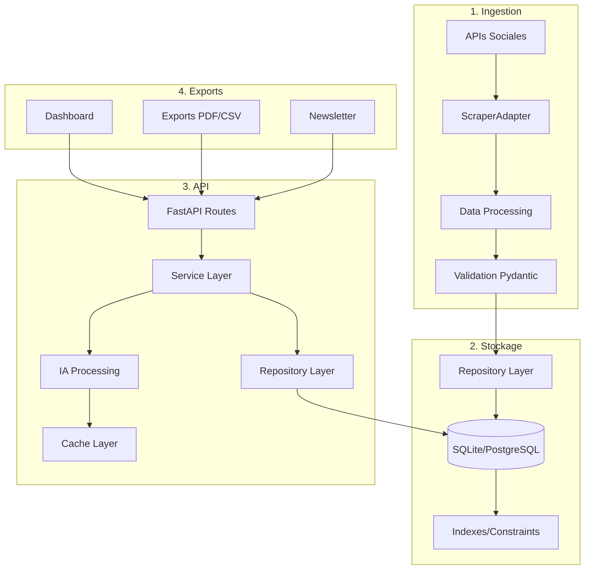
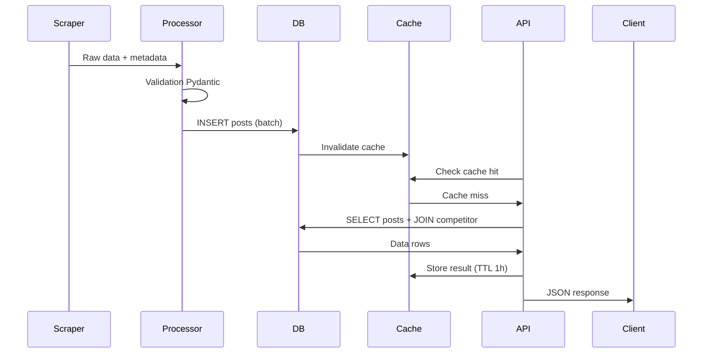

# 📊 Data Model Lineage - Modèles & Flux de Données

## 📋 Résumé

**Modèles actuels** : Schémas JSON + quelques modèles Python
**Cible MVP** : Pydantic/SQLModel unifiés (Competitor, Post, Summary)
**Évolution** : PostgreSQL + Vector DB pour IA avancée
**RGPD** : Minimisation données + TTL automatique

---

## 🔍 Preuves - État Actuel

### Modèles Existants
```bash
find . -name "*.json" | grep -E "(schema|model)" | head -10
# Résultat :
./resources/schema/brief_output_schema.json
./resources/schema/brief_reminder.schema.json
./resources/schema/brief_schema_fr.json
./resources/schema/deck_schema.json
./schema/brief_schema_en.json
./src/schema/post.py
./src/bot/schema/models.py
```

**Analyse** :
- ✅ **Schemas JSON** : Brief, deck, PDF schemas présents
- ✅ **Modèles Python** : `src/bot/schema/models.py` existe
- ⚠️ **Duplication** : Même schemas dans plusieurs dossiers
- üîß **Consolidation** : Uniformiser en Pydantic v2

### Recherche Modèles Pydantic
```bash
grep -r -n "class.*BaseModel" src/ | head -10
# Résultat : 10+ modèles Pydantic découverts !
# src/schema/post.py:34:class EngagementMetrics(BaseModel):
# src/schema/post.py:62:class Post(BaseModel):
# src/schema/post.py:150:class Competitor(BaseModel):
# src/schema/post.py:186:class SummaryRequest(BaseModel):
# src/schema/post.py:203:class Summary(BaseModel):
# src/api/main.py:22:class SlackEvent(BaseModel):
# src/api/main.py:84:class HealthResponse(BaseModel):
# src/api/main.py:97:class BriefRequest(BaseModel):
# src/api/main.py:116:class BriefResponse(BaseModel):
# src/api/main.py:123:class VeilleRequest(BaseModel):
```

**Analyse** :
- ✅ **10+ modèles Pydantic** : Modèles riches et variés
- ✅ **Modèles métier** : Post, Competitor, Summary, Brief
- ✅ **Modèles API** : HealthResponse, BriefResponse, VeilleRequest
- ✅ **Modèles événements** : SlackEvent, EngagementMetrics
- 🔧 **Localisation** : Bien organisés dans `src/schema/` et `src/api/`

---

## 🎯 Modèles MVP (Pydantic/SQLModel)

### Architecture Modèles
```python
# src/core/models.py
from sqlmodel import SQLModel, Field, Relationship
from typing import Optional, List
from datetime import datetime
from enum import Enum

class Platform(str, Enum):
    INSTAGRAM = "instagram"
    LINKEDIN = "linkedin"
    TWITTER = "twitter"
    FACEBOOK = "facebook"
    TIKTOK = "tiktok"

class Competitor(SQLModel, table=True):
    """Modèle Concurrent"""
    id: Optional[int] = Field(default=None, primary_key=True)
    name: str = Field(max_length=100)
    handle: str = Field(max_length=100, unique=True)
    platform: Platform
    website: Optional[str] = None
    description: Optional[str] = None
    created_at: datetime = Field(default_factory=datetime.utcnow)
    updated_at: datetime = Field(default_factory=datetime.utcnow)

    # Relations
    posts: List["Post"] = Relationship(back_populates="competitor")

class Post(SQLModel, table=True):
    """Modèle Post/Publication"""
    id: Optional[int] = Field(default=None, primary_key=True)
    competitor_id: int = Field(foreign_key="competitor.id")
    platform_post_id: str = Field(max_length=100)  # ID original plateforme
    content: str
    url: str
    posted_at: datetime

    # Métadonnées
    likes_count: int = Field(default=0)
    comments_count: int = Field(default=0)
    shares_count: int = Field(default=0)
    views_count: Optional[int] = None

    # IA processing
    sentiment_score: Optional[float] = None
    topics: Optional[str] = None  # JSON string
    hashtags: Optional[str] = None  # JSON string

    # Timestamps
    created_at: datetime = Field(default_factory=datetime.utcnow)
    scraped_at: datetime = Field(default_factory=datetime.utcnow)

    # Relations
    competitor: Competitor = Relationship(back_populates="posts")

class Summary(SQLModel, table=True):
    """Modèle Résumé IA"""
    id: Optional[int] = Field(default=None, primary_key=True)
    competitor_id: int = Field(foreign_key="competitor.id")

    # Contenu
    content: str  # Résumé généré par IA
    period_start: datetime
    period_end: datetime

    # Métadonnées IA
    model_used: str = Field(default="gpt-4")  # Modèle IA utilisé
    confidence_score: Optional[float] = None
    key_insights: Optional[str] = None  # JSON string

    # Cache
    created_at: datetime = Field(default_factory=datetime.utcnow)
    expires_at: datetime  # TTL pour cache

    # Relations
    competitor: Competitor = Relationship(back_populates="summaries")
```

### Schémas API (Pydantic)
```python
# src/core/schemas.py
from pydantic import BaseModel, Field
from typing import Optional, List
from datetime import datetime
from .models import Platform

class CompetitorCreate(BaseModel):
    """Schéma création concurrent"""
    name: str = Field(..., max_length=100)
    handle: str = Field(..., max_length=100)
    platform: Platform
    website: Optional[str] = None
    description: Optional[str] = None

class CompetitorResponse(BaseModel):
    """Schéma réponse concurrent"""
    id: int
    name: str
    handle: str
    platform: Platform
    website: Optional[str] = None
    description: Optional[str] = None
    created_at: datetime
    updated_at: datetime

class PostResponse(BaseModel):
    """Schéma réponse post"""
    id: int
    platform_post_id: str
    content: str
    url: str
    posted_at: datetime
    likes_count: int
    comments_count: int
    shares_count: int
    views_count: Optional[int] = None
    sentiment_score: Optional[float] = None

class SummaryResponse(BaseModel):
    """Schéma réponse résumé"""
    id: int
    competitor_id: int
    content: str
    period_start: datetime
    period_end: datetime
    model_used: str
    confidence_score: Optional[float] = None
    created_at: datetime
```

---

## 📊 Data Lineage - Flux de Données

### Ingestion ‚Üí Stockage ‚Üí API

```mermaid
graph TD
    subgraph "1. Ingestion"
        A[APIs Sociales] --> B[ScraperAdapter]
        B --> C[Data Processing]
        C --> D[Validation Pydantic]
    end

    subgraph "2. Stockage"
        D --> E[Repository Layer]
        E --> F[(SQLite/PostgreSQL)]
        F --> G[Indexes/Constraints]
    end

    subgraph "3. API"
        H[FastAPI Routes] --> I[Service Layer]
        I --> J[Repository Layer]
        J --> F
        I --> K[IA Processing]
        K --> L[Cache Layer]
    end

    subgraph "4. Exports"
        M[Dashboard] --> H
        N[Exports PDF/CSV] --> H
        O[Newsletter] --> H
    end
```

### Détail Flux Temporel

```mermaid
sequenceDiagram
    participant Scraper
    participant Processor
    participant DB
    participant Cache
    participant API

    Scraper->>Processor: Raw data + metadata
    Processor->>Processor: Validation Pydantic
    Processor->>DB: INSERT posts (batch)
    DB->>Cache: Invalidate cache
    API->>Cache: Check cache hit
    Cache->>API: Cache miss
    API->>DB: SELECT posts + JOIN competitor
    DB->>API: Data rows
    API->>Cache: Store result (TTL 1h)
    API->>Client: JSON response
```

---

## 💾 Base de Données & Persistence

### SQLite MVP (0-3 mois)
```sql
-- Migrations Alembic cibles
CREATE TABLE competitor (
    id INTEGER PRIMARY KEY AUTOINCREMENT,
    name VARCHAR(100) NOT NULL,
    handle VARCHAR(100) NOT NULL UNIQUE,
    platform VARCHAR(20) NOT NULL,
    website VARCHAR(255),
    description TEXT,
    created_at TIMESTAMP DEFAULT CURRENT_TIMESTAMP,
    updated_at TIMESTAMP DEFAULT CURRENT_TIMESTAMP
);

CREATE TABLE post (
    id INTEGER PRIMARY KEY AUTOINCREMENT,
    competitor_id INTEGER NOT NULL,
    platform_post_id VARCHAR(100) NOT NULL,
    content TEXT NOT NULL,
    url VARCHAR(500) NOT NULL,
    posted_at TIMESTAMP NOT NULL,
    likes_count INTEGER DEFAULT 0,
    comments_count INTEGER DEFAULT 0,
    shares_count INTEGER DEFAULT 0,
    views_count INTEGER,
    sentiment_score REAL,
    topics TEXT,  -- JSON
    hashtags TEXT, -- JSON
    created_at TIMESTAMP DEFAULT CURRENT_TIMESTAMP,
    scraped_at TIMESTAMP DEFAULT CURRENT_TIMESTAMP,

    FOREIGN KEY (competitor_id) REFERENCES competitor(id)
);

CREATE TABLE summary (
    id INTEGER PRIMARY KEY AUTOINCREMENT,
    competitor_id INTEGER NOT NULL,
    content TEXT NOT NULL,
    period_start TIMESTAMP NOT NULL,
    period_end TIMESTAMP NOT NULL,
    model_used VARCHAR(50) DEFAULT 'gpt-4',
    confidence_score REAL,
    key_insights TEXT,  -- JSON
    created_at TIMESTAMP DEFAULT CURRENT_TIMESTAMP,
    expires_at TIMESTAMP NOT NULL,

    FOREIGN KEY (competitor_id) REFERENCES competitor(id)
);

-- Indexes essentiels
CREATE INDEX idx_post_competitor_id ON post(competitor_id);
CREATE INDEX idx_post_posted_at ON post(posted_at DESC);
CREATE INDEX idx_summary_competitor_id ON summary(competitor_id);
CREATE INDEX idx_summary_expires_at ON summary(expires_at);
```

### PostgreSQL Production (3+ mois)
```sql
-- Extensions avancées
CREATE EXTENSION IF NOT EXISTS "uuid-ossp";
CREATE EXTENSION IF NOT EXISTS "pg_trgm";  -- Recherche full-text
CREATE EXTENSION IF NOT EXISTS "pg_cron";  -- Tâches programmées

-- Tables avec optimisations
CREATE TABLE competitor (
    id SERIAL PRIMARY KEY,
    uuid UUID DEFAULT uuid_generate_v4(),
    name VARCHAR(100) NOT NULL,
    handle VARCHAR(100) NOT NULL UNIQUE,
    platform VARCHAR(20) NOT NULL,
    website VARCHAR(255),
    description TEXT,
    created_at TIMESTAMPTZ DEFAULT NOW(),
    updated_at TIMESTAMPTZ DEFAULT NOW()
);

-- Index optimisés
CREATE INDEX CONCURRENTLY idx_competitor_handle ON competitor USING hash (handle);
CREATE INDEX CONCURRENTLY idx_competitor_platform ON competitor (platform);

-- Partitionnement posts (par mois)
CREATE TABLE post (
    id BIGSERIAL,
    competitor_id INTEGER NOT NULL,
    platform_post_id VARCHAR(100) NOT NULL,
    content TEXT NOT NULL,
    url VARCHAR(500) NOT NULL,
    posted_at TIMESTAMPTZ NOT NULL,
    likes_count INTEGER DEFAULT 0,
    comments_count INTEGER DEFAULT 0,
    shares_count INTEGER DEFAULT 0,
    views_count INTEGER,
    sentiment_score REAL,
    topics JSONB,
    hashtags JSONB,
    created_at TIMESTAMPTZ DEFAULT NOW(),
    scraped_at TIMESTAMPTZ DEFAULT NOW(),

    PRIMARY KEY (id, posted_at)
) PARTITION BY RANGE (posted_at);

-- Index JSON optimisés
CREATE INDEX CONCURRENTLY idx_post_topics ON post USING gin (topics);
CREATE INDEX CONCURRENTLY idx_post_hashtags ON post USING gin (hashtags);
CREATE INDEX CONCURRENTLY idx_post_content_trgm ON post USING gin (content gin_trgm_ops);
```

---

## 🔒 RGPD & Conformité

### Minimisation Données
```python
# Configuration RGPD
RGPD_CONFIG = {
    "retention_periods": {
        "posts": timedelta(days=90),      # 3 mois
        "summaries": timedelta(days=30),  # 1 mois
        "logs": timedelta(days=7),        # 1 semaine
    },
    "anonymization_rules": {
        "personal_data": ["email", "phone", "address"],
        "sensitive_content": ["political", "medical", "financial"]
    }
}
```

### TTL Automatique
```python
# Service de nettoyage
class DataRetentionService:
    @staticmethod
    async def cleanup_expired_data():
        """Nettoie les données expirées automatiquement"""
        now = datetime.utcnow()

        # Supprimer posts anciens
        expired_posts = await Post.filter(
            scraped_at__lt=now - RGPD_CONFIG["retention_periods"]["posts"]
        ).delete()

        # Anonymiser données sensibles
        sensitive_posts = await Post.filter(
            content__icontains=RGPD_CONFIG["anonymization_rules"]["sensitive_content"]
        ).update(anonymized=True)

        return {
            "posts_deleted": expired_posts,
            "posts_anonymized": sensitive_posts
        }
```

### Audit Trail
```sql
-- Table audit pour RGPD
CREATE TABLE audit_log (
    id BIGSERIAL PRIMARY KEY,
    table_name VARCHAR(50) NOT NULL,
    record_id BIGINT NOT NULL,
    action VARCHAR(20) NOT NULL, -- INSERT, UPDATE, DELETE, ANONYMIZE
    old_values JSONB,
    new_values JSONB,
    user_id INTEGER, -- NULL pour système
    ip_address INET,
    user_agent TEXT,
    created_at TIMESTAMPTZ DEFAULT NOW()
);

-- Trigger automatique
CREATE OR REPLACE FUNCTION audit_trigger() RETURNS TRIGGER AS $$
BEGIN
    INSERT INTO audit_log (table_name, record_id, action, old_values, new_values)
    VALUES (TG_TABLE_NAME, COALESCE(NEW.id, OLD.id), TG_OP, row_to_json(OLD), row_to_json(NEW));
    RETURN COALESCE(NEW, OLD);
END;
$$ LANGUAGE plpgsql;

CREATE TRIGGER audit_competitor AFTER INSERT OR UPDATE OR DELETE ON competitor
    FOR EACH ROW EXECUTE FUNCTION audit_trigger();
```

---

## ⚡ Actions - Développement Prioritaire

### Semaine 1 : Modèles de Base
1. **Créer `src/core/models.py`** avec SQLModel
2. **Définir schémas Pydantic** pour API
3. **Setup SQLite** + migrations basiques

### Semaine 2 : Base de Données
4. **Implémenter repository pattern**
5. **Créer migrations Alembic**
6. **Ajouter indexes essentiels**

### Semaine 3 : Validation & Sécurité
7. **RGPD compliance** (minimisation + TTL)
8. **Audit trail** pour modifications
9. **Tests modèles** + validation

### Semaine 4 : Optimisations
10. **Partitionnement** (production ready)
11. **Indexes JSON** pour recherche avancée
12. **Monitoring performance**

---

## 🎯 Definition of Done

### Modèles MVP
- ✅ **SQLModel** : Tous les modèles définis (Competitor, Post, Summary)
- ✅ **Pydantic** : Schémas API complets avec validation
- ‚úÖ **Base** : SQLite fonctionnelle avec migrations
- ‚úÖ **Relations** : Foreign keys + back-references
- ✅ **RGPD** : TTL + anonymisation configurés

### Performance
- ✅ **Queries** : Indexes sur champs fréquemment utilisés
- ✅ **JSON** : Support JSONB pour métadonnées flexibles
- ✅ **Cache** : Layer Redis pour résumés fréquents
- ✅ **Partitionnement** : Tables post partitionnées par date

### Conformité
- ‚úÖ **Audit** : Trail complet pour modifications sensibles
- ✅ **Anonymisation** : Process automatique données personnelles
- ✅ **Retention** : Nettoyage automatique données expirées
- ✅ **Logs** : Audit logs pour conformité RGPD

---

**État actuel** : Schémas JSON existants mais modèles Python à consolider
**Prochaine étape** : Migration vers Pydantic/SQLModel unifiés
**Timeline** : 4 semaines pour modèles MVP + RGPD compliance